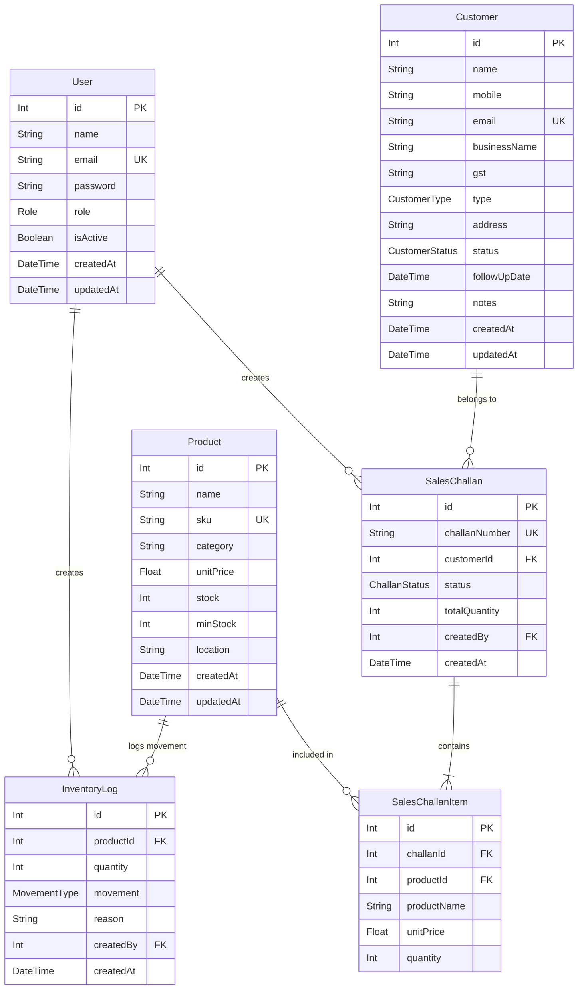

# System Architecture & Database Design

This document details the architectural principles, data flow, component design, and database schema for **Fundsroom ERP CRM**.

---

## 🏛️ High-Level Architecture

The system follows a classic **3-Tier Architecture**:

```mermaid
graph TD
    Client["Frontend SPA (React + Vite + TailwindCSS)"]
    API["Backend API Server (Express + TypeScript)"]
    Auth["JWT Authentication & Role Middleware"]
    ORM["Prisma ORM Client"]
    DB[("PostgreSQL Database (Neon DB Cloud)")]

    Client -->|HTTP / REST (Axios)| API
    API --> Auth
    Auth --> ORM
    ORM -->|TCP Connection Pool| DB
```

---

## 📊 Database Schema (Prisma / PostgreSQL)

### Entity Relationship Diagram (ERD)



---

## 🔐 Key Data Models & Enums

### Enums
- **`Role`**: `ADMIN`, `SALES`, `WAREHOUSE`, `ACCOUNTS`
- **`CustomerType`**: `RETAIL`, `WHOLESALE`, `DISTRIBUTOR`
- **`CustomerStatus`**: `LEAD`, `ACTIVE`, `INACTIVE`
- **`ChallanStatus`**: `DRAFT`, `CONFIRMED`, `CANCELLED`
- **`MovementType`**: `IN`, `OUT`

---

## ⚙️ Core Business Workflows

### 1. Inventory & Stock Movement Workflow
1. When stock is received or dispatched, an `InventoryLog` entry is created (`IN` or `OUT`).
2. Atomically, `Product.stock` is updated in a transaction or service routine.
3. If `Product.stock <= Product.minStock`, low-stock alerts are triggered in the Warehouse dashboard.

### 2. Sales Challan Workflow
1. Sales representative creates a `SalesChallan` with line items (`SalesChallanItem`).
2. Initial status is `DRAFT`.
3. Upon confirmation (`CONFIRMED`), stock is automatically deducted from `Product.stock` and an `OUT` `InventoryLog` is recorded.
